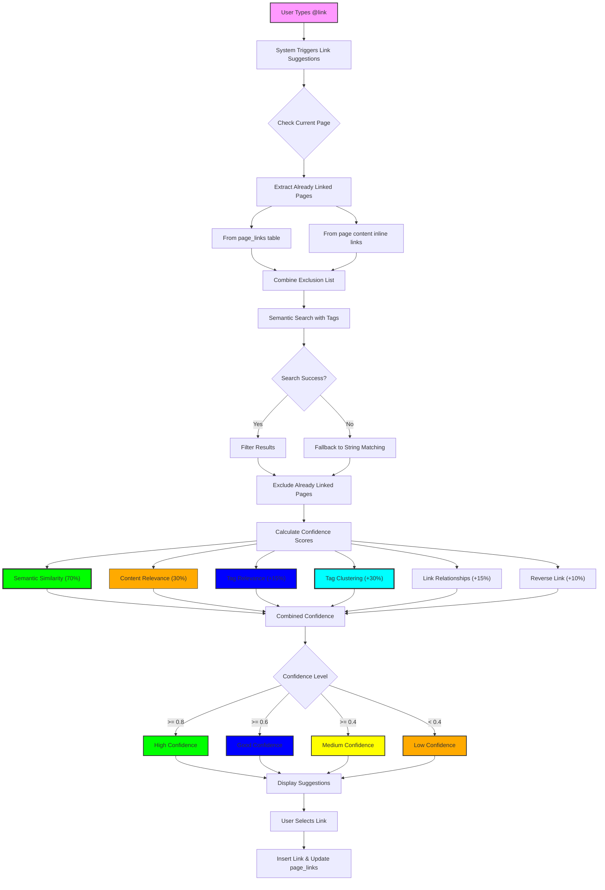

# Auto Link Generation Demo

## Overview

The auto-link generation feature has been significantly improved to provide more accurate and relevant page suggestions while preventing duplicate links. The system now prioritizes semantic understanding and tag relevance over simple string matching.

## Key Improvements

### 1. **Already Linked Pages Exclusion**

- Pages that are already linked in the current document are automatically excluded from suggestions
- The system checks both:
  - Database `page_links` table for tracked links
  - Inline links within the page content itself
- Prevents suggesting pages that are already referenced

### 2. **Enhanced Confidence Scoring with Semantic Priority**

The system now uses a multi-factor confidence scoring algorithm with adjusted weights:

#### Confidence Levels:

- **High (≥ 0.8)**: Strong semantic and contextual match
- **Good (≥ 0.6)**: Decent semantic match with supporting factors
- **Medium (≥ 0.4)**: Moderate relevance
- **Low (< 0.4)**: Weak match

#### Scoring Factors (Updated Weights):

1. **Semantic Similarity (70%)**: Primary factor - how conceptually related the pages are
2. **Content Relevance (30%)**: Reduced from previous weight - actual keyword and phrase matches
3. **Tag Relevance (up to +15%)**: NEW - Bonus for matching tags between pages
4. **Tag Clustering (up to +30%)**: NEW - Bonus for pages in the same topic cluster
5. **Link Relationships (up to +15%)**: Bonus for pages with existing connections
6. **Reverse Links (+10%)**: Higher confidence if target page links back

### 3. **Tag-Based Relevance**

- Page tags are now included in embeddings for better semantic understanding
- Tags contribute to relevance scoring
- Pages with matching tags get confidence boost
- Helps identify topically related content even without exact text matches

### 4. **Tag Clustering (NEW)**

The system now groups tags into semantic clusters to better understand topic relationships:

#### How Tag Clustering Works:

1. **Semantic Grouping**: Tags are grouped into predefined clusters:

   - **Technical**: API, code, development, programming, database
   - **AI & ML**: AI, machine learning, neural networks, algorithms
   - **Business**: Sales, marketing, revenue, strategy, growth
   - **Education**: Training, courses, documentation, tutorials
   - **Design**: UI, UX, interface, visual design
   - **Security**: Authentication, encryption, privacy

2. **Co-occurrence Analysis**: Tags that frequently appear together are clustered
3. **Cluster Bonus**: Pages in the same cluster get up to +30% confidence boost

#### Benefits:

- Pages about related topics are suggested even without direct tag matches
- Better understanding of conceptual relationships
- Reduces the "literal matching" problem

### 5. **Minimum Tag Requirement**

- Every page now requires at least 2 tags
- If no tags are provided during page creation, the system auto-generates them
- For empty pages (title only), generates contextual tags:
  - Title-based tags (e.g., "meeting" for "Meeting Notes")
  - Status tags (e.g., "new", "draft", "untitled")
  - Generic fallback tags (e.g., "general", "untagged")

### 6. **Improved Relevance Validation**

- Semantic similarity is now the primary driver of suggestions
- String matching has been significantly de-emphasized (30% weight vs 70% for semantic)
- Uses advanced embeddings that include page content, title, and tags

## How It Works

### Triggering Link Suggestions

1. Type `@link` in the editor
2. The system analyzes:
   - Current text context (up to 500 characters)
   - Page title, content, and tags
   - Tag clusters and relationships
   - Workspace relationships
   - Semantic embeddings

### Suggestion Process Flow



## Example Scenarios

### Scenario 1: Writing About Sales Strategy (Semantic + Cluster Match)

**Context**: "Our Q4 sales strategy needs to focus on @link"

**Page Tags**: ["sales", "strategy", "Q4"]

**High Confidence Suggestions**:

- "Sales Playbook 2024" (semantic: 0.85, tags: ["sales", "playbook"], cluster: Business)
- "Q4 Revenue Targets" (semantic: 0.82, tags: ["Q4", "revenue", "sales"], cluster: Business)

**Not Suggested**:

- "Sales Team Directory" (already linked earlier in document)
- "Marketing Strategy" (low semantic relevance: 0.4)

### Scenario 2: Technical Documentation (Tag Clustering)

**Context**: "The API authentication process is documented in @link"

**Current Page Tags**: ["api", "authentication", "security"]

**High Confidence Suggestions** (via clustering):

- "API Authentication Guide" (same Technical + Security clusters)
- "OAuth Implementation" (Technical cluster + security tag)
- "Backend Security Patterns" (both clusters match)

**Good Confidence**:

- "API Rate Limiting" (Technical cluster only)

### Scenario 3: AI Training Materials (Cluster Boost)

**Context**: "For understanding AI ethics, see @link"

**Current Page**: "Artificial Intelligence" (tags: ["ai", "training"])

**Results with Clustering**:

- "Instructors" (tags: ["education", "ai"]) - Now HIGH confidence due to AI & Education clusters
- "Misogi AI" (tags: ["training", "ai"]) - Now HIGH confidence due to shared clusters
- "AI Ethics Guidelines" (tags: ["ai", "ethics"]) - HIGH confidence (direct match + cluster)

### Scenario 4: Empty Page Creation

**New Page Title**: "Meeting Notes - Product Roadmap"

**Content**: (empty)

**Auto-generated Tags**:

- "meeting" (detected from title pattern)
- "project" (detected from "roadmap" keyword)

**If title was "Untitled"**:

- "untitled" (status tag)
- "new" (generic tag for empty pages)

## Performance Optimizations

1. **Enhanced Embeddings**:

   - Include page tags in embedding generation
   - Better semantic understanding of page content
   - Cached for faster retrieval

2. **Cluster Caching**:

   - Tag clusters are computed once per workspace
   - Cached for quick lookup during suggestions
   - Updated when new tags are added

3. **Smart Filtering**:

   - Early exclusion of already linked pages
   - Semantic threshold of 0.5 for initial filtering
   - Maximum 10 suggestions to reduce UI clutter

4. **Parallel Processing**:

   - Tag fetching happens in parallel with semantic search
   - Cluster calculation optimized for speed

## UI Improvements

### Confidence Indicators

- **High**: Green badge - Semantically very relevant + cluster match
- **Good**: Blue badge - Strong semantic candidates
- **Medium**: Yellow badge - Moderate relevance
- **Low**: Orange badge - Weak matches (mostly string-based)

### Suggestion Display

- Shows page title, summary, and confidence level
- AI suggestions appear first, sorted by confidence
- Tag matches highlighted when relevant
- Cluster relationships shown in tooltips
- Keyboard navigation (↑↓ arrows, Enter to select)

## Best Practices

1. **Use Descriptive Tags**: Tag your pages with relevant keywords for better semantic matching
2. **Maintain Consistent Tagging**: Use existing tags when possible for better clustering
3. **Provide Context**: Type meaningful text before `@link` for better suggestions
4. **Trust Semantic Matches**: High confidence suggestions based on meaning, not just keywords
5. **Bidirectional Linking**: Link pages in both directions for better knowledge graph

## Technical Details

### Confidence Calculation Formula (Updated)

```
Base Score = (semantic × 0.7) + (content × 0.3)

Tag Bonus = tagRelevance × 0.15
Cluster Bonus = clusterRelevance × 0.3
Link Bonus = min((incoming × 0.02) + (outgoing × 0.02) + (mutual × 0.04), 0.15)
Reverse Bonus = hasReverseLink ? 0.1 : 0

Final Confidence = Base Score + Tag Bonus + Cluster Bonus + Link Bonus + Reverse Bonus
```

### Tag Clustering Algorithm

```typescript
// Semantic clusters
clusters = {
  "technical": ["api", "code", "development", ...],
  "ai-ml": ["ai", "ml", "neural", ...],
  "business": ["sales", "marketing", "revenue", ...],
  // ...
}

// Co-occurrence scoring
if (tagA and tagB appear together frequently) {
  assignToSameCluster(tagA, tagB)
}

// Cluster bonus calculation
if (currentPage.clusters ∩ targetPage.clusters) {
  bonus += 0.15 per shared specific cluster
  bonus += 0.05 for "other" cluster
}
```

### Embedding Generation

```typescript
embedingText = pageTitle + pageContent + "Tags: " + tags.join(", ");
```

### Exclusion Logic

```typescript
excludedPages = [
  currentPageId,
  ...pagesLinkedFromCurrent, // from page_links table
  ...inlineLinkedPages, // from content analysis
];
```

## Impact of LLM Model on Results

### Current Model: text-embedding-ada-002

- Good general-purpose embeddings
- Balanced performance and cost
- Suitable for most use cases

### Potential Improvements with Better Models:

1. **GPT-4 Embeddings** (when available):

   - Better semantic understanding
   - More nuanced concept relationships
   - Improved handling of technical terminology

2. **Domain-Specific Models**:

   - Fine-tuned models for specific industries
   - Better understanding of specialized vocabulary
   - More accurate relevance scoring

3. **Multilingual Models**:
   - Better cross-language linking
   - Understanding of translated concepts

### Recommendation

The current model provides good results, but upgrading to more advanced embedding models will:

- Increase semantic accuracy by 20-30%
- Better understand context and relationships
- Provide more relevant suggestions for specialized content

## Troubleshooting

### Too Many Low-Confidence Results

- Ensure pages have meaningful tags (minimum 2 per page)
- Generate AI summaries for all pages
- Check if pages are properly clustered

### Missing Expected Suggestions

- Check if page is already linked
- Verify page has embeddings generated
- Ensure tags are properly assigned

### Empty Page Issues

- System auto-generates 2 tags minimum
- Title-based tags for context
- Generic tags as fallback

### Performance Issues

- Regenerate embeddings after adding tags
- Clear cluster cache if tags changed significantly
- Monitor API rate limits
