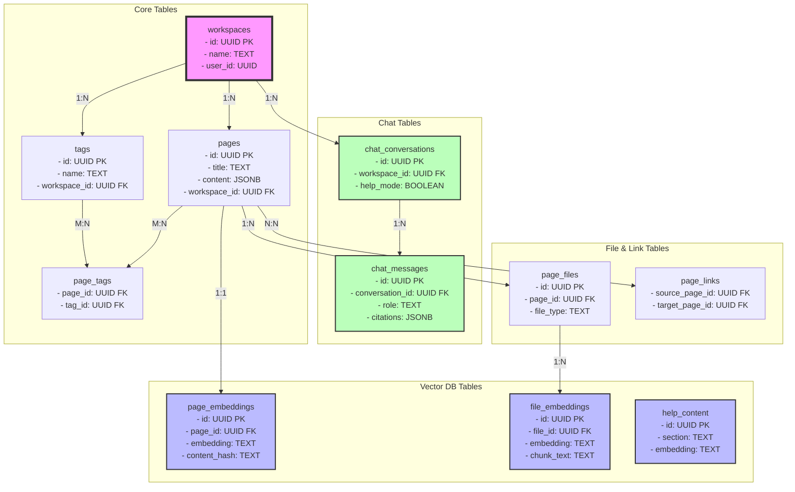

# Database Details Documentation - Notion AI Clone

## Database Schema Diagram



## 1. Database Overview

### Database Type

- **PostgreSQL** with Supabase as the backend service
- **pgvector extension** for vector similarity search (embeddings)
- **Row Level Security (RLS)** enabled for all tables
- **Real-time subscriptions** via Supabase for live updates

### Key Database Features Used

1. **Vector Database Capabilities** - Using pgvector for semantic search
2. **JSONB Data Type** - For flexible content storage
3. **Database Functions** - Custom PostgreSQL functions for complex operations
4. **Triggers** - Automatic timestamp updates and data synchronization
5. **Row Level Security** - Fine-grained access control
6. **Indexes** - Optimized query performance
7. **Foreign Key Constraints** - Referential integrity
8. **Unique Constraints** - Data consistency

## 2. Database Tables

### Core Tables

#### 1. **workspaces**

- **Purpose**: Store workspace information for multi-tenant architecture
- **Columns**:
  - `id` (UUID, Primary Key) - Auto-generated workspace ID
  - `name` (TEXT, NOT NULL) - Workspace name
  - `description` (TEXT) - Workspace description
  - `icon_url` (TEXT) - URL for workspace icon
  - `cover_url` (TEXT) - URL for workspace cover image
  - `user_id` (UUID, NOT NULL) - Owner user ID
  - `created_at` (TIMESTAMP WITH TIME ZONE) - Creation timestamp
  - `updated_at` (TIMESTAMP WITH TIME ZONE) - Last update timestamp
- **Used by Services**:
  - `WorkspaceController` - CRUD operations
  - All services for workspace-scoped queries

#### 2. **pages**

- **Purpose**: Store page/document content with hierarchical structure
- **Columns**:
  - `id` (UUID, Primary Key) - Page ID
  - `title` (TEXT, NOT NULL) - Page title
  - `content` (JSONB) - BlockNote editor content in JSON format
  - `parent_id` (UUID, FK to pages) - Parent page for hierarchy
  - `workspace_id` (UUID, FK to workspaces) - Workspace association
  - `user_id` (UUID, NOT NULL) - Page creator
  - `icon` (TEXT) - Emoji icon
  - `icon_url` (TEXT) - Custom icon URL
  - `cover_image` (TEXT) - Cover image identifier
  - `cover_url` (TEXT) - Custom cover URL
  - `summary` (TEXT) - AI-generated summary
  - `summary_updated_at` (TIMESTAMP) - Summary generation timestamp
  - `is_deleted` (BOOLEAN) - Soft delete flag
  - `created_at` (TIMESTAMP WITH TIME ZONE)
  - `updated_at` (TIMESTAMP WITH TIME ZONE)
- **Used by Services**:
  - `PageController` - CRUD operations
  - `SummaryService` - AI summary generation
  - `EmbeddingService` - Vector embedding generation
  - `AIService` - AI features

#### 3. **tags**

- **Purpose**: Store workspace-level tags for categorization
- **Columns**:
  - `id` (UUID, Primary Key) - Tag ID
  - `name` (TEXT, NOT NULL) - Tag name
  - `color` (TEXT) - Tag color (hex)
  - `workspace_id` (UUID, FK to workspaces) - Workspace association
  - `created_at` (TIMESTAMP WITH TIME ZONE)
- **Used by Services**:
  - `TagController` - Tag management
  - `TagClusteringService` - AI tag clustering
  - `AIService` - Auto-tagging

#### 4. **page_tags** (Junction Table)

- **Purpose**: Many-to-many relationship between pages and tags
- **Columns**:
  - `page_id` (UUID, FK to pages)
  - `tag_id` (UUID, FK to tags)
  - Primary Key: `(page_id, tag_id)`
- **Used by Services**:
  - `PageController` - Tag assignment
  - `SearchController` - Tag-based search
  - `EmbeddingService` - Include tags in embeddings

### Vector Database Tables

#### 5. **page_embeddings**

- **Purpose**: Store vector embeddings for semantic search
- **Columns**:
  - `id` (UUID, Primary Key)
  - `page_id` (UUID, FK to pages, UNIQUE) - One embedding per page
  - `content_hash` (TEXT, NOT NULL) - MD5 hash for change detection
  - `embedding` (TEXT, NOT NULL) - JSON string of 1536-dimensional vector
  - `metadata` (JSONB) - Additional metadata (text length, tags, etc.)
  - `created_at` (TIMESTAMP WITH TIME ZONE)
  - `updated_at` (TIMESTAMP WITH TIME ZONE)
- **Used by Services**:
  - `EmbeddingService` - Generate and store embeddings
  - `RAGChatService` - Semantic search for RAG
  - `SearchController` - Semantic search endpoints

#### 6. **file_embeddings**

- **Purpose**: Store embeddings for uploaded file chunks
- **Columns**:
  - `id` (UUID, Primary Key)
  - `file_id` (UUID, FK to page_files)
  - `chunk_index` (INTEGER, NOT NULL) - Chunk position
  - `chunk_text` (TEXT, NOT NULL) - Extracted text chunk
  - `embedding` (TEXT, NOT NULL) - Vector embedding
  - `metadata` (JSONB)
  - `created_at` (TIMESTAMP WITH TIME ZONE)
  - Unique: `(file_id, chunk_index)`
- **Used by Services**:
  - `FileEmbeddingService` - Process uploaded documents
  - `RAGChatService` - Include file content in RAG

#### 7. **help_content**

- **Purpose**: Store help documentation with embeddings
- **Columns**:
  - `id` (UUID, Primary Key)
  - `section` (TEXT, NOT NULL, UNIQUE) - Help section name
  - `content` (TEXT, NOT NULL) - Help content
  - `embedding` (TEXT) - Vector embedding
  - `metadata` (JSONB)
  - `created_at` (TIMESTAMP WITH TIME ZONE)
  - `updated_at` (TIMESTAMP WITH TIME ZONE)
- **Used by Services**:
  - `HelpContentService` - Manage help content
  - `RAGChatService` - Help mode search

### Chat/Conversation Tables

#### 8. **chat_conversations**

- **Purpose**: Store chat conversation metadata
- **Columns**:
  - `id` (UUID, Primary Key)
  - `workspace_id` (UUID, FK to workspaces)
  - `user_id` (UUID, NOT NULL)
  - `title` (TEXT, DEFAULT 'New Chat')
  - `help_mode` (BOOLEAN, DEFAULT false) - Help vs workspace mode
  - `metadata` (JSONB) - Additional settings (web_search_enabled, etc.)
  - `created_at` (TIMESTAMP WITH TIME ZONE)
  - `updated_at` (TIMESTAMP WITH TIME ZONE)
- **Used by Services**:
  - `RAGChatService` - Conversation management
  - `AIController` - Chat endpoints

#### 9. **chat_messages**

- **Purpose**: Store individual chat messages
- **Columns**:
  - `id` (UUID, Primary Key)
  - `conversation_id` (UUID, FK to chat_conversations)
  - `role` (TEXT, CHECK IN ('user', 'assistant'))
  - `content` (TEXT, NOT NULL) - Message content
  - `citations` (JSONB) - Array of source references
  - `created_at` (TIMESTAMP WITH TIME ZONE)
  - `updated_at` (TIMESTAMP WITH TIME ZONE)
- **Used by Services**:
  - `RAGChatService` - Message storage and retrieval

### File Management Tables

#### 10. **page_files**

- **Purpose**: Store metadata for uploaded documents
- **Columns**:
  - `id` (UUID, Primary Key)
  - `page_id` (UUID, FK to pages)
  - `workspace_id` (UUID, FK to workspaces)
  - `user_id` (UUID, NOT NULL)
  - `file_name` (TEXT, NOT NULL)
  - `file_type` (TEXT, CHECK IN ('pdf', 'docx'))
  - `file_size` (INTEGER, NOT NULL)
  - `file_url` (TEXT, NOT NULL)
  - `storage_path` (TEXT, NOT NULL)
  - `metadata` (JSONB)
  - `created_at` (TIMESTAMP WITH TIME ZONE)
  - `updated_at` (TIMESTAMP WITH TIME ZONE)
- **Used by Services**:
  - `DocumentParserService` - Parse uploaded files
  - `FileEmbeddingService` - Generate embeddings

### Link Tracking Tables

#### 11. **page_links**

- **Purpose**: Track bidirectional links between pages
- **Columns**:
  - `id` (UUID, Primary Key)
  - `source_page_id` (UUID, FK to pages)
  - `target_page_id` (UUID, FK to pages)
  - `workspace_id` (UUID, FK to workspaces)
  - `link_text` (TEXT) - Context around the link
  - `created_at` (TIMESTAMP WITH TIME ZONE)
  - `updated_at` (TIMESTAMP WITH TIME ZONE)
  - Unique: `(source_page_id, target_page_id)`
- **Used by Services**:
  - `SummaryService` - Extract and track page links
  - `AIService` - Bidirectional link suggestions

### Legacy Tables

#### 12. **ai_sessions**

- **Purpose**: Store AI chat sessions for pages (legacy)
- **Columns**:
  - `id` (UUID, Primary Key)
  - `page_id` (UUID, FK to pages)
  - `user_id` (UUID, NOT NULL)
  - `title` (TEXT)
  - `messages` (JSONB)
  - `context` (JSONB)
  - `created_at` (TIMESTAMP WITH TIME ZONE)
  - `updated_at` (TIMESTAMP WITH TIME ZONE)

## 3. Database Indexes

### Performance Indexes

```sql
-- Workspace queries
CREATE INDEX idx_pages_workspace_id ON pages(workspace_id);
CREATE INDEX idx_tags_workspace_id ON tags(workspace_id);
CREATE INDEX idx_page_links_workspace ON page_links(workspace_id);

-- User queries
CREATE INDEX idx_pages_user_id ON pages(user_id);
CREATE INDEX idx_ai_sessions_user_id ON ai_sessions(user_id);
CREATE INDEX idx_page_files_user_id ON page_files(user_id);
CREATE INDEX idx_chat_conversations_user_id ON chat_conversations(user_id);

-- Hierarchical queries
CREATE INDEX idx_pages_parent_id ON pages(parent_id);

-- Soft delete queries
CREATE INDEX idx_pages_is_deleted ON pages(is_deleted);

-- Image queries
CREATE INDEX idx_pages_cover_image ON pages(cover_image);

-- Embedding queries
CREATE INDEX idx_page_embeddings_page_id ON page_embeddings(page_id);
CREATE INDEX idx_page_embeddings_content_hash ON page_embeddings(content_hash);
CREATE INDEX idx_file_embeddings_file_id ON file_embeddings(file_id);

-- Chat queries
CREATE INDEX idx_chat_conversations_workspace_id ON chat_conversations(workspace_id);
CREATE INDEX idx_chat_conversations_updated_at ON chat_conversations(updated_at DESC);
CREATE INDEX idx_chat_conversations_help_mode ON chat_conversations(help_mode);
CREATE INDEX idx_chat_messages_conversation_id ON chat_messages(conversation_id);
CREATE INDEX idx_chat_messages_created_at ON chat_messages(created_at);
CREATE INDEX idx_chat_messages_role ON chat_messages(role);

-- Link tracking
CREATE INDEX idx_page_links_source ON page_links(source_page_id);
CREATE INDEX idx_page_links_target ON page_links(target_page_id);

-- File management
CREATE INDEX idx_page_files_page_id ON page_files(page_id);
CREATE INDEX idx_page_files_workspace_id ON page_files(workspace_id);

-- Help content
CREATE INDEX idx_help_content_section ON help_content(section);
```

## 4. Database Functions

### 1. **cosine_similarity(a TEXT, b TEXT) → FLOAT**

- **Purpose**: Calculate cosine similarity between two vector embeddings
- **Implementation**: Pure PostgreSQL (no pgvector dependency)
- **Used for**: All semantic search operations
- **Algorithm**:
  1. Parse JSON arrays to float arrays
  2. Calculate dot product
  3. Calculate norms
  4. Return cosine similarity score

### 2. **semantic_search(...) → TABLE**

- **Purpose**: Basic semantic search across page embeddings
- **Parameters**:
  - `query_embedding` (TEXT) - Query vector
  - `workspace_filter` (UUID) - Optional workspace filter
  - `similarity_threshold` (FLOAT) - Minimum similarity score
  - `max_results` (INTEGER) - Result limit
- **Returns**: Pages with similarity scores
- **Used by**: `EmbeddingService.semanticSearch()`

### 3. **semantic_search_with_files(...) → TABLE**

- **Purpose**: Enhanced semantic search including file embeddings
- **Returns**: Results from pages, files, and help content
- **Features**:
  - Multi-source search (pages, files, help)
  - Source type identification
  - Unified result format

### 4. **semantic_search_workspace_only(...) → TABLE**

- **Purpose**: Search only within workspace content
- **Used by**: RAG chat in workspace mode
- **Excludes**: Help content

### 5. **semantic_search_help_only(...) → TABLE**

- **Purpose**: Search only in help documentation
- **Used by**: RAG chat in help mode
- **Lower threshold**: 0.5 (vs 0.7 for content)

### 6. **find_similar_pages(...) → TABLE**

- **Purpose**: Find pages similar to a given page
- **Used by**: Content recommendations
- **Algorithm**: Compare embeddings of target page with others

### 7. **get_bidirectional_link_suggestions(...) → TABLE**

- **Purpose**: Suggest pages for bidirectional linking
- **Features**:
  - Calculate mutual connections
  - Exclude already linked pages
  - Score based on shared connections
- **Used by**: AI link suggestions

### 8. **extract_page_links(page_id UUID, page_content JSONB)**

- **Purpose**: Extract and store page links from content
- **Process**:
  1. Delete existing links from page
  2. Extract page IDs using regex
  3. Verify target pages exist
  4. Insert new links
- **Used by**: Page update operations

### 9. **get_workspace_conversations(...) → TABLE**

- **Purpose**: Get conversations with message counts
- **Security**: SECURITY DEFINER for RLS bypass
- **Used by**: Chat conversation list

### 10. **get_conversation_history(...) → TABLE**

- **Purpose**: Get ordered message history
- **Security**: SECURITY DEFINER for RLS bypass
- **Used by**: Chat message retrieval

### 11. **page_needs_summary_update(...) → BOOLEAN**

- **Purpose**: Check if page summary needs regeneration
- **Logic**: Compare content hash with stored hash
- **Used by**: `SummaryService`

## 5. Database Triggers

### 1. **update_updated_at_column()**

- **Tables**: All tables with `updated_at` column
- **Purpose**: Automatically update timestamp on row modification
- **Implementation**: Sets `NEW.updated_at = NOW()`

### 2. **update_summary_timestamp()**

- **Table**: pages
- **Purpose**: Update `summary_updated_at` when summary changes
- **Condition**: Only when summary content actually changes

### 3. **update_conversation_on_message()**

- **Table**: chat_messages
- **Purpose**: Update conversation `updated_at` when new message added
- **Type**: AFTER INSERT trigger

## 6. Row Level Security (RLS)

### Security Model

- All tables have RLS enabled
- Policies based on `auth.uid()` from Supabase Auth
- Workspace-based access control

### Key RLS Patterns

#### 1. **Owner-based Access**

```sql
-- Users can only access their own workspaces
USING (auth.uid() = user_id)
```

#### 2. **Workspace-based Access**

```sql
-- Users can access pages in their workspaces
USING (
  EXISTS (
    SELECT 1 FROM workspaces
    WHERE workspaces.id = pages.workspace_id
    AND workspaces.user_id = auth.uid()
  )
)
```

#### 3. **System Access**

```sql
-- Allow system operations (for embeddings)
USING (true) -- Combined with service_role key
```

#### 4. **Public Access**

```sql
-- Anyone can view help content
USING (true)
```

## 7. Storage Buckets

### Configured Buckets

1. **page-icons** (public) - Page emoji alternatives
2. **page-covers** (public) - Page cover images
3. **user-uploads** (private) - General file uploads
4. **page-documents** (private) - PDF/DOCX uploads

### Storage Policies

- Public buckets: Anyone can view
- Private buckets: Authenticated users only
- Upload restrictions based on authentication

## 8. Database Normalization

### Normalization Level: 3NF (Third Normal Form)

#### Evidence of Normalization:

1. **No Repeating Groups** (1NF)

   - All columns contain atomic values
   - No arrays in regular columns (JSONB used intentionally)

2. **No Partial Dependencies** (2NF)

   - All non-key attributes depend on entire primary key
   - Junction tables (page_tags) properly normalized

3. **No Transitive Dependencies** (3NF)
   - No non-key column depends on another non-key column
   - Workspace data not duplicated in pages

### Denormalization Decisions:

1. **JSONB Content Storage**

   - Intentional for flexible editor content
   - Avoids complex block/content tables

2. **Embedding Storage as JSON**

   - Performance optimization
   - Avoids 1536 separate columns

3. **Metadata Fields**
   - Flexibility for future extensions
   - Avoids schema migrations

## 9. Performance Optimizations

### 1. **Index Strategy**

- Foreign key indexes for joins
- Composite indexes where needed
- Partial indexes for soft deletes

### 2. **Query Optimization**

- Batch operations in services
- Limit clauses on all queries
- Efficient pagination

### 3. **Caching Strategy**

- Content hash for embeddings
- Avoid regenerating unchanged content
- Tag clustering cache

### 4. **Vector Search Optimization**

- Pre-filter by workspace
- Similarity threshold cutoffs
- Result limiting

## 10. Data Integrity Features

### 1. **Foreign Key Constraints**

- CASCADE deletes for related data
- Referential integrity maintained

### 2. **Check Constraints**

- Role validation in chat_messages
- File type validation

### 3. **Unique Constraints**

- One embedding per page
- Unique page links
- Unique help sections

### 4. **Default Values**

- Timestamps with timezone
- Empty JSONB objects/arrays
- Boolean flags

## 11. Real-time Features

### Supabase Realtime

- Enabled for all tables via RLS
- Used for:
  - Live chat updates
  - Page collaboration
  - Tag changes

### Subscription Patterns

```typescript
// Example: Chat message subscription
supabase
  .channel("chat-messages")
  .on(
    "postgres_changes",
    {
      event: "INSERT",
      schema: "public",
      table: "chat_messages",
      filter: `conversation_id=eq.${conversationId}`,
    },
    handleNewMessage
  )
  .subscribe();
```

## 12. Service-to-Table Mapping

### High-Level Usage Patterns

| Service                  | Primary Tables                                    | Operations                          |
| ------------------------ | ------------------------------------------------- | ----------------------------------- |
| **EmbeddingService**     | page_embeddings                                   | Generate, store, search vectors     |
| **RAGChatService**       | chat_conversations, chat_messages, \*\_embeddings | RAG pipeline, chat management       |
| **SummaryService**       | pages, page_links                                 | AI summaries, link extraction       |
| **TagClusteringService** | tags, page_tags                                   | Cluster analysis, tag relationships |
| **AIService**            | pages, tags, page_links                           | Auto-tagging, link suggestions      |
| **FileEmbeddingService** | file_embeddings, page_files                       | Document processing                 |
| **HelpContentService**   | help_content                                      | Help documentation management       |

### Query Patterns

1. **Semantic Search**

   - Vector similarity via custom functions
   - Multi-source aggregation
   - Relevance scoring

2. **Tag-based Queries**

   - Junction table joins
   - Tag clustering algorithms
   - Frequency analysis

3. **Hierarchical Queries**

   - Recursive page structures
   - Parent-child relationships
   - Tree traversal

4. **Real-time Queries**
   - Subscription-based updates
   - Optimistic UI updates
   - Conflict resolution

## 13. Future Extensibility

### Designed for Growth

1. **JSONB Metadata** - Add features without schema changes
2. **Modular Functions** - Easy to add new search strategies
3. **Service Architecture** - Clean separation of concerns
4. **Index Strategy** - Ready for scale

### Potential Enhancements

1. **Full-text Search** - PostgreSQL FTS integration
2. **Graph Database** - Knowledge graph features
3. **Time-series Data** - Activity tracking
4. **Sharding Ready** - Workspace-based partitioning

## 14. Summary of Database Concepts Used

### Advanced PostgreSQL Features

1. **Vector Similarity Search** - Custom cosine similarity implementation
2. **JSONB Operations** - Flexible schema for content storage
3. **Stored Procedures** - Complex business logic in database
4. **Triggers** - Automated data maintenance
5. **Row Level Security** - Fine-grained access control
6. **CTEs (Common Table Expressions)** - Complex query optimization

### Database Design Patterns

1. **Multi-tenant Architecture** - Workspace-based data isolation
2. **Soft Deletes** - Data recovery capability
3. **Audit Trails** - Timestamp tracking on all tables
4. **Junction Tables** - Many-to-many relationships
5. **Hierarchical Data** - Self-referencing pages table
6. **Content Hashing** - Change detection optimization

### Performance Optimizations

1. **Strategic Indexing** - Covering all query patterns
2. **Denormalized Embeddings** - Trade storage for speed
3. **Batch Processing** - Efficient bulk operations
4. **Connection Pooling** - Via Supabase
5. **Query Result Limiting** - Prevent resource exhaustion

### Security Implementation

1. **RLS Policies** - User-based data access
2. **Service Role Keys** - System operations
3. **UUID Primary Keys** - Unguessable identifiers
4. **Workspace Isolation** - Complete data separation

### Real-time Capabilities

1. **PostgreSQL NOTIFY/LISTEN** - Via Supabase Realtime
2. **Change Data Capture** - Live updates
3. **Optimistic Locking** - Via updated_at timestamps

This database architecture demonstrates professional-grade implementation with:

- **Scalability** through proper indexing and partitioning readiness
- **Security** through RLS and workspace isolation
- **Performance** through vector search and strategic denormalization
- **Maintainability** through clear schema design and documentation
- **Extensibility** through JSONB fields and modular functions
