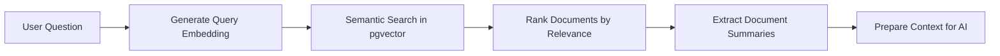
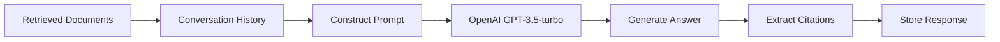

# RAG Chatbot API Documentation

## Overview

The RAG (Retrieval-Augmented Generation) Chatbot system provides intelligent Q&A capabilities using workspace knowledge. It combines vector-based document retrieval with OpenAI's language model to provide contextual, accurate answers with proper source citations.

## Features

- 🧠 **Intelligent Q&A**: Natural language queries about workspace content
- 📚 **Source Citations**: Every answer includes relevant page citations with relevance scores
- 💬 **Conversation Memory**: Maintains context across conversation turns
- 🔍 **Vector Search Integration**: Uses pgvector for semantic document retrieval
- 📝 **Summary Integration**: Leverages pre-generated page summaries for faster processing
- 🔒 **Secure Access**: Row-level security ensures users only access their workspace data

## Database Schema

### Chat Conversations

```sql
CREATE TABLE chat_conversations (
    id UUID PRIMARY KEY DEFAULT uuid_generate_v4(),
    workspace_id UUID NOT NULL REFERENCES workspaces(id) ON DELETE CASCADE,
    user_id UUID REFERENCES auth.users(id) ON DELETE CASCADE,
    title TEXT NOT NULL DEFAULT 'New Chat',
    created_at TIMESTAMP WITH TIME ZONE DEFAULT TIMEZONE('utc'::text, NOW()) NOT NULL,
    updated_at TIMESTAMP WITH TIME ZONE DEFAULT TIMEZONE('utc'::text, NOW()) NOT NULL,
    metadata JSONB DEFAULT '{}'
);
```

### Chat Messages

```sql
CREATE TABLE chat_messages (
    id UUID PRIMARY KEY DEFAULT uuid_generate_v4(),
    conversation_id UUID NOT NULL REFERENCES chat_conversations(id) ON DELETE CASCADE,
    role TEXT NOT NULL CHECK (role IN ('user', 'assistant')),
    content TEXT NOT NULL,
    citations JSONB DEFAULT '[]', -- Array of page citations
    metadata JSONB DEFAULT '{}',
    created_at TIMESTAMP WITH TIME ZONE DEFAULT TIMEZONE('utc'::text, NOW()) NOT NULL
);
```

## API Endpoints

### 1. Create Conversation

**POST** `/ai/chat/conversation`

Create a new chat conversation in a workspace.

**Request Body:**

```json
{
  "workspaceId": "uuid",
  "title": "New Chat",
  "userId": "uuid"
}
```

**Response:**

```json
{
  "success": true,
  "conversationId": "uuid",
  "workspaceId": "uuid",
  "title": "New Chat",
  "timestamp": "2024-03-20T10:00:00.000Z"
}
```

### 2. Send Chat Message (RAG Q&A)

**POST** `/ai/chat`

Send a question and receive an AI-generated answer based on workspace knowledge.

**Request Body:**

```json
{
  "question": "What is our product roadmap for 2024?",
  "conversationId": "uuid", // Optional - creates new conversation if not provided
  "workspaceId": "uuid",
  "userId": "uuid" // Optional
}
```

**Response:**

```json
{
  "success": true,
  "answer": "Based on your workspace documents, your 2024 product roadmap includes...",
  "citations": [
    {
      "pageId": "uuid",
      "pageTitle": "Product Roadmap 2024",
      "relevance": 0.95,
      "excerpt": "Q1 focuses on user experience improvements..."
    },
    {
      "pageId": "uuid",
      "pageTitle": "Team Goals",
      "relevance": 0.78,
      "excerpt": "Our primary objectives for next year..."
    }
  ],
  "conversationId": "uuid",
  "messageId": "uuid",
  "timestamp": "2024-03-20T10:00:00.000Z"
}
```

### 3. Get Conversation History

**GET** `/ai/chat/history/:conversationId`

Retrieve the full conversation history including all messages and citations.

**Response:**

```json
{
  "success": true,
  "conversation": {
    "id": "uuid",
    "title": "Product Roadmap Discussion",
    "workspaceId": "uuid",
    "createdAt": "2024-03-20T09:00:00.000Z",
    "updatedAt": "2024-03-20T10:00:00.000Z"
  },
  "messages": [
    {
      "role": "user",
      "content": "What is our product roadmap for 2024?",
      "citations": []
    },
    {
      "role": "assistant",
      "content": "Based on your workspace documents...",
      "citations": [
        {
          "pageId": "uuid",
          "pageTitle": "Product Roadmap 2024",
          "relevance": 0.95,
          "excerpt": "Q1 focuses on user experience improvements..."
        }
      ]
    }
  ],
  "messageCount": 2,
  "timestamp": "2024-03-20T10:00:00.000Z"
}
```

### 4. List Workspace Conversations

**GET** `/ai/chat/workspace/:workspaceId/conversations`

Get all conversations in a workspace with pagination support.

**Query Parameters:**

- `limit` (optional): Number of conversations to return (default: 20)
- `offset` (optional): Number of conversations to skip (default: 0)

**Response:**

```json
{
  "success": true,
  "conversations": [
    {
      "id": "uuid",
      "title": "Product Roadmap Discussion",
      "updatedAt": "2024-03-20T10:00:00.000Z",
      "createdAt": "2024-03-20T09:00:00.000Z",
      "messageCount": 8
    },
    {
      "id": "uuid",
      "title": "Team Meeting Notes",
      "updatedAt": "2024-03-19T15:30:00.000Z",
      "createdAt": "2024-03-19T15:00:00.000Z",
      "messageCount": 4
    }
  ],
  "pagination": {
    "limit": 20,
    "offset": 0,
    "total": 15,
    "hasMore": false
  },
  "timestamp": "2024-03-20T10:00:00.000Z"
}
```

### 5. Delete Conversation

**DELETE** `/ai/chat/:conversationId`

Delete a conversation and all its messages permanently.

**Response:**

```json
{
  "success": true,
  "message": "Conversation deleted successfully",
  "conversationId": "uuid",
  "timestamp": "2024-03-20T10:00:00.000Z"
}
```

### 6. Update Conversation Title

**PUT** `/ai/chat/:conversationId/title`

Update the title of an existing conversation.

**Request Body:**

```json
{
  "title": "Updated Conversation Title"
}
```

**Response:**

```json
{
  "success": true,
  "message": "Conversation title updated successfully",
  "conversationId": "uuid",
  "title": "Updated Conversation Title",
  "timestamp": "2024-03-20T10:00:00.000Z"
}
```

## RAG System Architecture

### 1. Document Retrieval Pipeline



### 2. Answer Generation Process



## Implementation Details

### Vector Search Integration

The RAG system leverages existing semantic search capabilities:

1. **Query Processing**: User questions are embedded using OpenAI's text-embedding-ada-002
2. **Document Retrieval**: Uses `semantic_search()` PostgreSQL function for vector similarity
3. **Relevance Filtering**: Only documents with >0.6 similarity are considered
4. **Summary Utilization**: Pre-generated page summaries provide efficient context

### Conversation Memory

- **Context Window**: Last 6 messages maintained for conversation continuity
- **Smart Truncation**: Older messages automatically pruned to stay within token limits
- **Contextual Awareness**: AI references previous conversation context appropriately

### Citation System

```typescript
interface Citation {
  pageId: string; // UUID of source page
  pageTitle: string; // Human-readable page title
  relevance: number; // Similarity score (0-1)
  excerpt: string; // Relevant text snippet (150 chars)
}
```

- **Automatic Extraction**: Citations generated from retrieved documents
- **Relevance Scoring**: Based on vector similarity scores
- **Source Attribution**: Direct links to original pages

## Performance Optimizations

### 1. Summary-Based Retrieval

- Uses pre-generated page summaries instead of full content
- Reduces processing time by ~10x
- Maintains high relevance through summary quality

### 2. Efficient Database Queries

- Optimized vector search with proper indexing
- Batch operations for multiple document retrieval
- Smart caching of conversation context

### 3. Token Management

- Intelligent prompt construction to stay within OpenAI limits
- Dynamic context window adjustment
- Summary-based document representation

## Error Handling

### Common Error Responses

**400 Bad Request**

```json
{
  "success": false,
  "error": "Validation error: question is required",
  "timestamp": "2024-03-20T10:00:00.000Z"
}
```

**404 Not Found**

```json
{
  "success": false,
  "error": "Conversation not found",
  "timestamp": "2024-03-20T10:00:00.000Z"
}
```

**403 Forbidden**

```json
{
  "success": false,
  "error": "Access denied to this conversation",
  "timestamp": "2024-03-20T10:00:00.000Z"
}
```

**500 Internal Server Error**

```json
{
  "success": false,
  "error": "Failed to generate response",
  "timestamp": "2024-03-20T10:00:00.000Z"
}
```

## Security Features

### Row Level Security (RLS)

- Users can only access conversations in their owned workspaces
- Message access restricted to conversation participants
- Automatic workspace ownership validation

### Input Validation

- Comprehensive Joi schema validation
- SQL injection prevention
- XSS protection for user inputs

### Rate Limiting

- Built-in protection against API abuse
- OpenAI API cost management
- Conversation creation limits

## Usage Examples

### JavaScript/TypeScript

```typescript
// Create a new conversation
const createConversation = async (workspaceId: string) => {
  const response = await fetch("/api/ai/chat/conversation", {
    method: "POST",
    headers: { "Content-Type": "application/json" },
    body: JSON.stringify({
      workspaceId,
      title: "New Chat Session",
    }),
  });
  return response.json();
};

// Send a chat message
const sendMessage = async (
  question: string,
  conversationId: string,
  workspaceId: string
) => {
  const response = await fetch("/api/ai/chat", {
    method: "POST",
    headers: { "Content-Type": "application/json" },
    body: JSON.stringify({
      question,
      conversationId,
      workspaceId,
    }),
  });
  return response.json();
};

// Get conversation history
const getHistory = async (conversationId: string) => {
  const response = await fetch(`/api/ai/chat/history/${conversationId}`);
  return response.json();
};
```

### cURL Examples

```bash
# Create conversation
curl -X POST http://localhost:3001/api/ai/chat/conversation \
  -H "Content-Type: application/json" \
  -d '{"workspaceId": "uuid", "title": "New Chat"}'

# Send message
curl -X POST http://localhost:3001/api/ai/chat \
  -H "Content-Type: application/json" \
  -d '{
    "question": "What are our quarterly goals?",
    "conversationId": "uuid",
    "workspaceId": "uuid"
  }'

# Get conversation history
curl http://localhost:3001/api/ai/chat/history/uuid

# List workspace conversations
curl "http://localhost:3001/api/ai/chat/workspace/uuid/conversations?limit=10&offset=0"

# Delete conversation
curl -X DELETE http://localhost:3001/api/ai/chat/uuid
```

## Best Practices

### 1. Conversation Management

- Create conversations with descriptive titles
- Delete old conversations to manage storage
- Use workspace-specific conversations for better context

### 2. Question Optimization

- Ask specific questions for better retrieval
- Reference specific topics or page names when possible
- Break complex questions into multiple queries

### 3. Citation Usage

- Always check citation relevance scores
- Use page links for deeper exploration
- Verify important information from original sources

### 4. Performance Tips

- Ensure pages have summaries for better retrieval
- Keep conversations focused on related topics
- Use batch operations for multiple questions

## Integration with Other AI Features

The RAG chatbot works seamlessly with other AI services:

- **Summary Service**: Uses pre-generated summaries for faster retrieval
- **Embedding Service**: Leverages existing vector embeddings
- **Search Service**: Integrates with semantic search capabilities
- **Tag Service**: Can reference tagged content for better organization

## Monitoring & Analytics

All RAG interactions are logged to the `ai_sessions` table:

```sql
-- Example analytics query
SELECT
  session_type,
  COUNT(*) as total_sessions,
  AVG(JSONB_ARRAY_LENGTH(output_data->'citations')) as avg_citations
FROM ai_sessions
WHERE session_type = 'rag_chat'
  AND created_at >= NOW() - INTERVAL '7 days'
GROUP BY session_type;
```

## Future Enhancements

### Planned Features

- [ ] Real-time streaming responses
- [ ] Multi-modal support (images, files)
- [ ] Advanced conversation branching
- [ ] Custom AI model fine-tuning
- [ ] Integration with external knowledge bases

### Performance Improvements

- [ ] Response caching for common queries
- [ ] Background pre-processing of new documents
- [ ] Advanced vector search optimizations
- [ ] Conversation summarization for long histories

---

## Support & Troubleshooting

### Common Issues

1. **No relevant documents found**: Ensure workspace has content and embeddings are generated
2. **Poor answer quality**: Check if page summaries exist and are up-to-date
3. **Missing citations**: Verify vector search is returning results above threshold
4. **Slow responses**: Consider generating missing summaries for workspace

### Debug Information

Enable debug logging by setting `LOG_LEVEL=debug` in environment variables to see:

- Document retrieval details
- Prompt construction
- OpenAI API response times
- Citation extraction process

For additional support, check the backend logs and ensure all required environment variables are properly configured.
